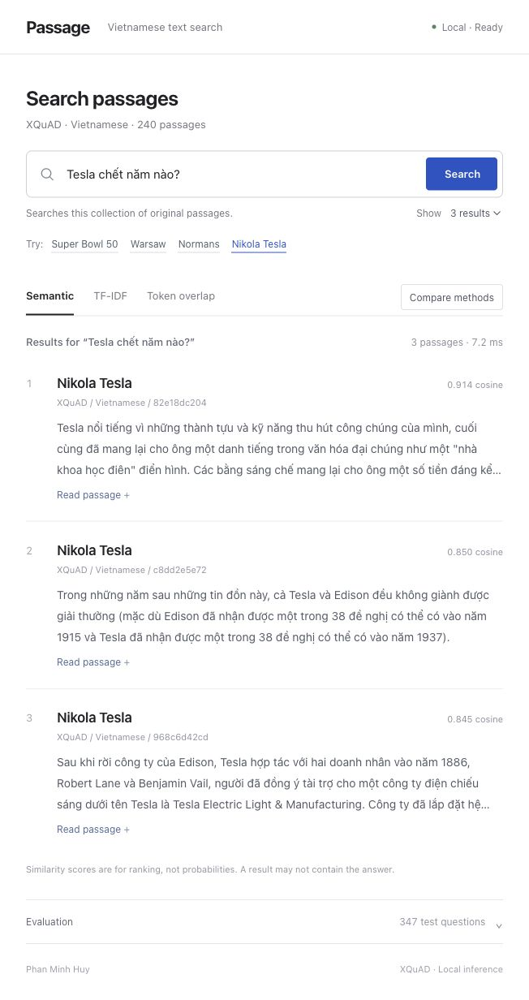

# Passage

**Vietnamese passage retrieval with lexical and semantic search.**

A local NLP experiment and interactive demo by Phan Minh Huy, developed with AI assistance. The collection contains **240 Vietnamese passages** and **1,190 questions** adapted from XQuAD. The project compares an inspectable token-overlap baseline, TF-IDF with cosine similarity, and a pretrained multilingual E5 encoder.

The demo retrieves existing text. It does not generate answers, train a language model, or search the web. No API key or paid inference service is required. After initial installation and downloads, search runs locally.



**Tiếng Việt:** bắt đầu với [bản đồ dự án](docs/PROJECT-MAP.md), rồi [lộ trình học qua sản phẩm đã có](docs/HOC-TIEP.md). The [contribution log](docs/CONTRIBUTIONS.md) records what was AI-assisted and what the student has personally practiced.

## Run the demo

Requires **Python 3.12–3.13**; **Python 3.12 is recommended**. The locked NumPy and SciPy versions require Python 3.12 or newer. Python 3.14 is not supported by this project's setup script. A CPU is sufficient for this small collection. Allow several gigabytes of free space for Python dependencies and the pretrained model. Internet is needed for the first setup.

### macOS

1. Download or clone this project into a folder you will keep.
2. Open Terminal. Type `cd `, drag the project folder into Terminal, and press Return. This puts Terminal inside that folder, including when its path contains spaces.
3. Run:

   ```bash
   bash setup.sh
   ```

4. Double-click **Open Retrieval Lab.command**. Keep its Terminal window open while using the demo. If macOS prevents double-click execution, run it from that same Terminal:

   ```bash
   bash "Open Retrieval Lab.command"
   ```

The launcher opens [http://127.0.0.1:8765](http://127.0.0.1:8765) after the server reports that it is ready. It reuses an existing instance of this app and reports a conflict if another application occupies that port. Press **Ctrl+C in the server's Terminal** to stop it.

Setup creates `.venv` inside the project, installs the pinned dependencies, prepares XQuAD and downloads the pinned E5 model. It does not install Python packages globally. You can select an existing interpreter explicitly:

```bash
PYTHON_BIN=/path/to/python3.12 bash setup.sh
```

### Terminal use

On macOS/Linux, run these from the project folder after setup:

```bash
.venv/bin/python server.py --host 127.0.0.1 --port 8765
.venv/bin/python search.py 'Norman là ai?' --method overlap --top-k 3
.venv/bin/python search.py 'Norman là ai?' --method tfidf --top-k 3
.venv/bin/python search.py 'Norman là ai?' --method semantic --top-k 3
```

The server and search commands are separate alternatives: the first keeps running until stopped; open a second Terminal to run CLI searches while the server is running. To use another port, change `--port` and open that address manually.

For Windows PowerShell, create and use a local environment directly:

```powershell
py -3.12 -m venv .venv
.venv\Scripts\python -m pip install -r requirements-lock.txt
.venv\Scripts\python dataset.py
.venv\Scripts\python setup_model.py
.venv\Scripts\python server.py --host 127.0.0.1 --port 8765
```

The macOS `.command` launcher is not used on Windows. The recorded verification environment is macOS; Windows setup is an unverified equivalent using the same Python entry points.

## What to try

- Enter a Vietnamese question. Switch between **Semantic**, **TF-IDF** and **Token overlap** to inspect each ranked list.
- Use **Compare methods** to see all three lists together.
- Select **Read passage** to open the complete text rather than judging a result by its title alone.
- Try a wording change and observe whether the ranking changes. One successful example does not establish general paraphrase robustness.
- Expand **Evaluation** for the recorded test metrics, or read the development and final evaluation reports below. Similarity scores have different scales across methods and are **not probabilities**.
- Keep the scope in mind: a question outside this 240-passage collection may still receive a semantically similar result that does not contain an answer.

## The experiment

**Question:** How do lexical matching and a pretrained semantic encoder compare on Vietnamese source-passage retrieval, and which ranking errors remain?

| Method | Representation and score | What to inspect |
|---|---|---|
| Token overlap | Number of distinct query tokens also present in a passage | Simple matching; ties and long passages can be misleading. |
| TF-IDF + cosine | Raw token counts weighted by `log((1 + N) / (1 + df)) + 1`, then L2-normalized | Rare-token weighting and length normalization; still depends on token overlap. |
| Multilingual E5 Small | 384-dimensional normalized embeddings; query-to-passage cosine similarity | Learned semantic similarity; can confuse related passages or miss details. |

Lexical methods normalize text to Unicode NFC, lowercase it and extract Unicode alphanumeric tokens. These are approximately Vietnamese syllables, not a complete linguistic word segmentation. Dense retrieval uses the pretrained model's tokenizer and the model card's `query: ` / `passage: ` prefixes. Model inputs are limited to 512 tokens; longer passages can lose information through truncation.

The pretrained encoder is [`intfloat/multilingual-e5-small`](https://huggingface.co/intfloat/multilingual-e5-small), pinned to revision `614241f622f53c4eeff9890bdc4f31cfecc418b3`. **No fine-tuning is performed.** Passage vectors are cached locally so they do not need to be recomputed for each query.

## Data and evaluation protocol

- Source: [Google DeepMind XQuAD](https://github.com/google-deepmind/xquad), by Mikel Artetxe, Sebastian Ruder and Dani Yogatama; [original paper](https://arxiv.org/abs/1910.11856).
- Pinned dataset revision: `7d30520c717524000f0d9d2f9c10a069acd9d285`. Preparation stores the raw file hash and source attribution.
- XQuAD is an extractive question-answering dataset. Here, each question's annotated source paragraph becomes its single relevant retrieval target.
- Identical paragraphs are deduplicated by content hash. A deterministic 70/30 split groups questions by paragraph with seed 42, producing **843 development questions** and **347 test questions**. The ratio applies to paragraph groups, not question counts.
- All **240 passages** remain in the candidate collection for both splits. IDF uses this known corpus; no question labels are used to fit a retriever.
- Develop and inspect errors on dev. Freeze methods before final test evaluation. Once test results are seen, they must not be used to choose changes and still be described as an untouched test.

This is a **closed-corpus passage retrieval adaptation**, not the official XQuAD QA benchmark, a test of unseen domains, or a cross-lingual transfer experiment. Its Hit/MRR scores must not be compared with the original QA exact-match or answer-F1 scores.

### Metrics and reports

| Metric | Meaning |
|---|---|
| Hit@1 | Fraction of questions whose annotated source paragraph ranks first. |
| Hit@5 | Fraction whose source paragraph appears among the first five results. |
| MRR@5 | Mean of `1 / rank` when the source paragraph appears in the first five; otherwise zero. |

The generated reports are the source of recorded results:

Final evaluation on **347 held-out questions** against **240 known passages**:

| Method | Hit@1 | Hit@5 | MRR@5 |
|---|---:|---:|---:|
| Token overlap | 77.81% | 90.20% | 0.8267 |
| TF-IDF + cosine | 83.57% | 97.98% | 0.8974 |
| Multilingual E5 Small | 93.08% | 99.14% | 0.9573 |

E5 recovered 48 top-1 answers that TF-IDF missed, while TF-IDF recovered 15 that E5 missed. This is a measured comparison on this small collection, not a claim of universal superiority. Read [the findings and inspected errors](docs/FINDINGS.md).

- [Development evaluation](results/dev-summary.md): 843 questions.
- [Final test evaluation](results/test-summary.md): 347 questions; use the recorded protocol and run metadata when interpreting it.
- [Development casebook](results/dev-error-analysis.md): successes, disagreements and failures.
- [Frozen research protocol](docs/RESEARCH-PROTOCOL.md): exact preparation, model and evaluation choices.

```bash
.venv/bin/python evaluate.py --split dev
.venv/bin/python -m unittest discover -s tests -v
```

The recorded frozen snapshot is included in `results/protocol.json`. Reproduce that final evaluation with:

```bash
.venv/bin/python evaluate.py --split test --final-test
```

When developing a new experiment before its first test, freeze with `python freeze_protocol.py` after development. Do not replace this recorded protocol or tune against the already-inspected test; see the research protocol for details.

Re-running a frozen implementation checks reproducibility; it does not create a new unseen test set. Query timing depends on hardware, batch size, device, cache state and whether model loading is included. Treat timing as a property of the documented run, not a portable speed claim.

## Project map

```text
dataset.py             Download, normalize, identify and split the data
retrieval.py           Inspectable overlap and TF-IDF algorithms
semantic.py            Pretrained encoder and local passage-vector cache
engine.py              One interface for the retrieval methods
search.py              Command-line search
evaluate.py            Compare rankings with annotated source passages
server.py              Local demo server
setup_model.py         Download/check the model and prepare its index
lessons/               Small examples to understand the core ideas
docs/                  Learning guide, project map and contribution log
results/               Evaluation summaries and local detailed rankings
tests/                 Ranking, metric and data-integrity checks
```

Read [the Vietnamese project map](docs/PROJECT-MAP.md) for the data flow and a manageable reading order. You do not need to memorize every server or UI line to understand the experiment; you do need to trace how an input becomes a ranking and how that ranking is evaluated.

## Troubleshooting

| Symptom | Next step |
|---|---|
| No supported Python found | Install Python 3.12 or set `PYTHON_BIN` to an existing Python 3.12–3.13 interpreter. The setup script does not install Python itself. |
| Package installation or model download fails | Read the first error, check Internet access and free disk space, then rerun `bash setup.sh`. Successful downloads are retained. |
| `.venv` exists but is incompatible/broken | Rename `.venv` to keep a backup, then rerun setup with Python 3.12. |
| Port 8765 is occupied | Stop the server you started or use `.venv/bin/python server.py --port 8766` and open that port manually. The launcher will not stop an unrelated app. |
| Browser does not open automatically | Keep the server running and open the printed local URL manually. |
| Missing dataset/model message | Run `bash setup.sh` to complete preparation. Search does not need an API key. |
| Different timing from the report | Check device, warm/cold loading and batching. Compare retrieval metrics separately from elapsed time. |

## Limits and authorship

This is a small translated collection with one annotated relevant passage per question. Other passages may be relevant but receive no credit. The corpus is known in advance; the benchmark cannot demonstrate reliable open-domain answering. Lexical matching loses linguistic structure, while semantic embeddings can confuse related topics. The pretrained model's training data is not fully auditable here, so this project cannot rule out benchmark exposure during pretraining.

Designed and reviewed by Phan Minh Huy, with implementation, documentation and evaluation supported by Codex. See the [development and learning log](docs/CONTRIBUTIONS.md) for roles and practical milestones. E5 is an upstream pretrained model used for inference.

Original code and documentation: [MIT](LICENSE). XQuAD-derived content: **CC BY-SA 4.0**. Model and library licenses remain separate; see [third-party notices](THIRD_PARTY.md).
